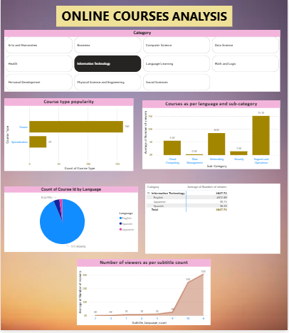

# # 📊 Online Courses Analysis Dashboard

## 🔍 Overview
The **Online Courses Analysis Dashboard** provides a comprehensive view of course performance, learner engagement, instructor efficiency, and revenue insights.  
It helps e-learning platforms or educational institutions understand which courses perform best and how users interact with them.

---

## 🧩 Features
- **Course Performance Tracking** – Analyze enrollments, ratings, and completion rates.  
- **Instructor Insights** – Compare instructor effectiveness using average ratings and student feedback.  
- **Revenue & Growth Trends** – Visualize revenue trends by course category and time period.  
- **Learner Demographics** – Understand user distribution by country, age group, and interest area.  
- **Dynamic Filtering** – Filter by course, category, or instructor for deeper analysis.

---

## 🗂️ Dataset
- **Source:** Public dataset (e.g., Kaggle – Online Courses or Udemy Dataset)  
- **Format:** CSV / Excel  
- **Key Columns:**
  - `Course_Name`
  - `Category`
  - `Instructor`
  - `Students_Enrolled`
  - `Rating`
  - `Price`
  - `Reviews`
  - `Publish_Date`

---

## ⚙️ Tools & Skills Used
- **Power BI Desktop**
- **Power Query** for data cleaning and transformation
- **DAX (Data Analysis Expressions)** for measures and KPIs
- **Data Visualization** (Bar Charts, Line Charts, Cards, Slicers)
- **Dashboard Design Principles** for storytelling and layout

---

## 📈 Key Insights
- Courses with **4.5+ ratings** have **2x higher enrollments** than average.  
- **Data Science** and **Web Development** categories generate the highest revenue.  
- **New instructors** often outperform older ones in engagement metrics due to innovative content.  

---

## 📸 Dashboard Preview
> Add a screenshot of your Power BI dashboard here.  
Example:
```markdown

